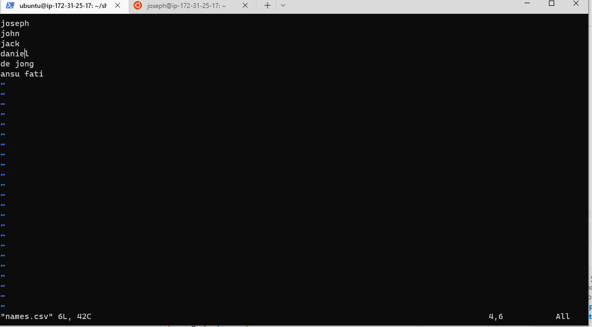
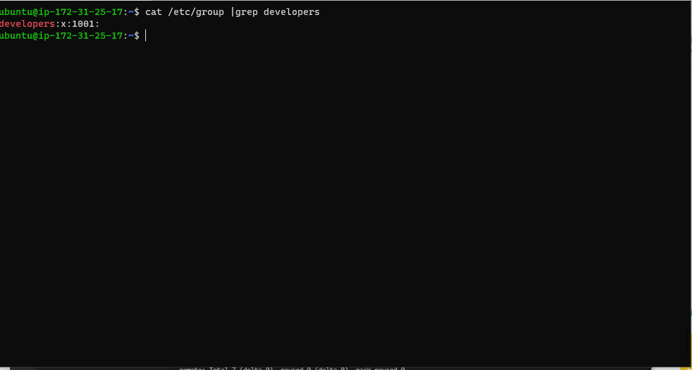
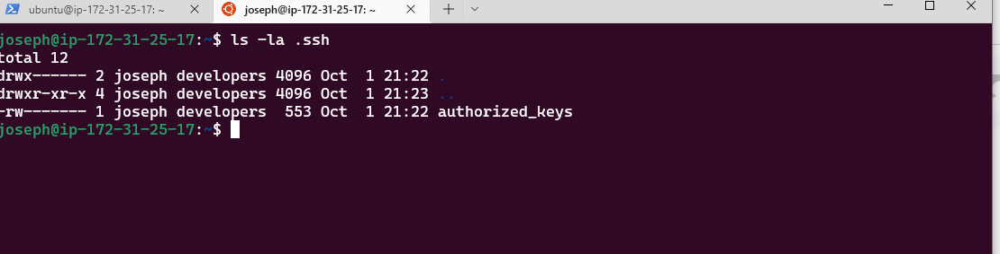
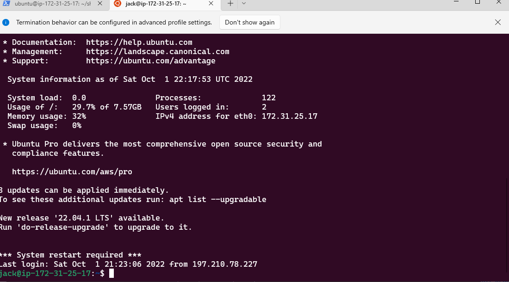

# AUXILIARY_PROJECTS 1 : SHELL SCRIPTING

Automate user creation by applying your shell scripting skills in the hands-on assignment. Onboard a list of new Linux users from a CSV file using a shell script.

- Create the project folder called Shell (mkdir Shell)

- Move into the Shell folder (cd shell)

- Create a csv file name names.csv (touch names.csv)
- Insert some random names into it. (One name per line)

- Create script onboarding.sh on the shell directory,ensure that the script is able to read the names on the names.csv file 

- To ensure our public keys are been created in the home directoy for users Go back to our home  and Type the command (pwd /home/ubuntu) ,copy it and paste on our scripts as shown in the image

- Group developers successfuly created 

- Confrimation of each user .ssh folder created by script

- In our current home directory we change directory to .ssh (cd .ssh)

- We create our public and private key files (touch id_rsa.pub id_rsa) 
- paste the given code in documentation (vi id_rsa.pub , vi id_rsa)

- Test a few of the users randomly, and ensure that you are able to connect to the server using the private key and the public key

